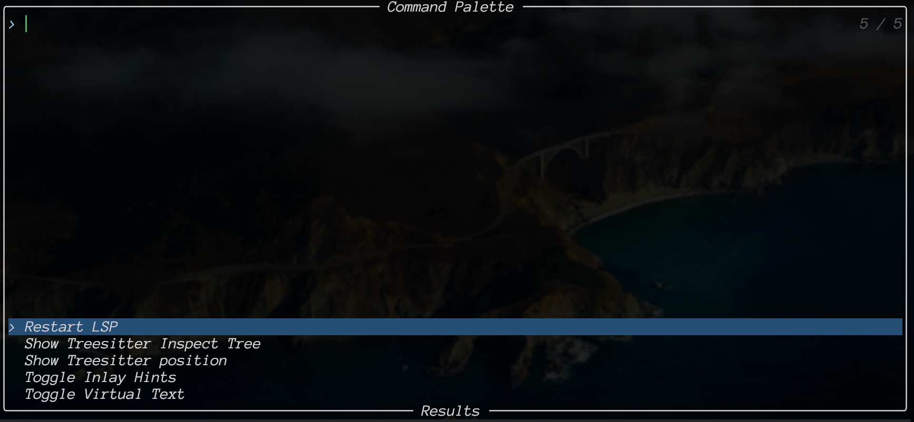

# Telescope Command Palette

This simple implementation of the Command Palette is built on top of [telescope.nvim](https://github.com/nvim-telescope/telescope.nvim) plugin.

## Installation

### [lazy.nvim](https://github.com/folke/lazy.nvim)
```lua
{
  "dmytr0x/command-palette.nvim",
  event = "VeryLazy",
  dependencies = {
    "nvim-telescope/telescope.nvim",
  },
  config = function()
    ...
  end,
}
```

## Thumbnail


## Configure

### Create a new command
```lua
local command_palette = require("command_palette")

-- It creates an entity of a new command
command_palette.command(
    "Title",        -- It displays the command title in the Telescope picker.
    function() end, -- The command itself must be a lua function
    "Terms",        -- Optional: Alternatives terms for search in telescope
    function() end  -- Optional: Initialisation function, invoke at setup() time
),
```

### Open a picker
```lua
config = function()
    local command_palette = require("command_palette")
    local sources = {
        -- Add your commands here using `command_palette.command` function
        -- e.g.
        command_palette.command("Restart LSP", function() vim.cmd("LspRestart") end, "lsp:reload"),
    }
    command_palette.setup(sources)
end
```

### Setup keymap
```lua
config = function()
    local command_palette = require("command_palette")
    ...
    vim.keymap.set("n", "<leader><leader>", function()
      command_palette.picker({})
    end)
end
```

## Tips & Trics

### The function structure
The whole plugin is just one file; it could quickly become flooded by the functions.
In this case, it would be better to use a separate `lua` table to gather your commands.
```lua
local fns = {}

function fns.restart_lsp()
  vim.cmd("LspRestart")
end
...
config = function()
    local command_palette = require("command_palette")
    local cmd = command_palette.command

    local sources = {
        cmd("Restart LSP", fns.restart_lsp, "lsp:reload"),
    }
    command_palette.setup(sources)
end
```

### The initialisation of the command
Each command could optionally have an init function, which will be called when 
the setup function is invoked. It could be helpful when you need to keep the state 
between the start of the plugin and after using the particular command.

**Example** of toggling `LSP: Inlay hints`:
```lua
local fns = {}

function fns.init_virtual_text()
  -- global shared state
  vim.g.diagnostic_virtual_text = false -- off by default
  
  vim.diagnostic.config({
    virtual_text = vim.g.diagnostic_virtual_text,
    float = { border = "single" },
  })
end

function fns.toggle_virtual_text()
  vim.g.diagnostic_virtual_text = not vim.g.diagnostic_virtual_text
  vim.diagnostic.config({ virtual_text = vim.g.diagnostic_virtual_text })
end

config = function()
    local command_palette = require("command_palette")
    local cmd = command_palette.command

    local sources = {
        cmd("Toggle Virtual Text", fns.toggle_virtual_text, "lsp", fns.init_virtual_text),
    }
    command_palette.setup(sources)
end
```